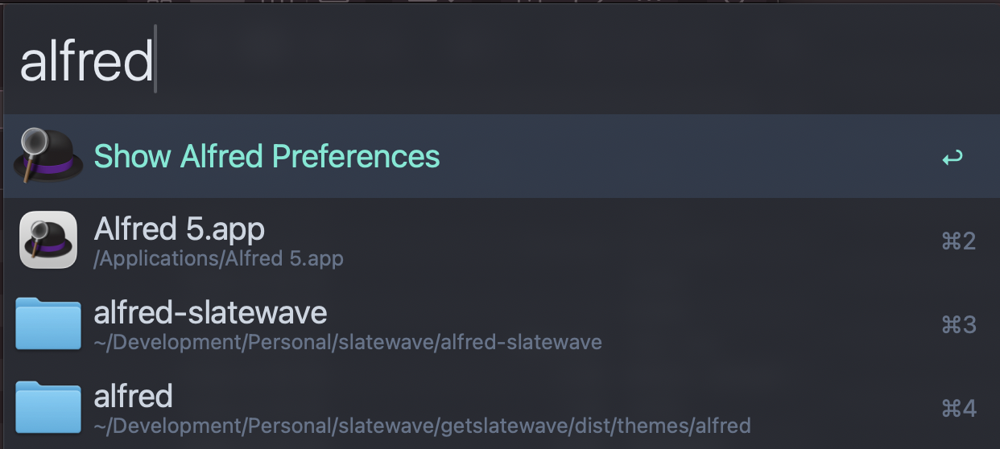

<div align="center">


<picture>
  <source media="(prefers-color-scheme: dark)" srcset="https://getslatewave.com/brand/wordmark-light.png">
  
</picture>

# Slatewave (Alfred)

A Slatewave theme for [Alfred](https://www.alfredapp.com) — slate foundation, teal signature. Part of the [Slatewave family](#slatewave-family) — one palette across editors, terminals, prompts, notes, and more.

> _Slate below, teal above._



</div>

---

## What it styles

Slatewave for Alfred is a single `.alfredappearance` preset tuned against Alfred 5's full appearance schema. It sets:

- **Window** — slate `#282c34` at 90% opacity with a 20pt blur, so Alfred feels like a frosted pane of the Slatewave editor hovering above your desktop
- **Border** — slate-800 `#1e293b`, matching `editorGroup.border` in the VSCode theme
- **Search field** — 36pt System Light on a transparent background, `#e2e8f0` foreground, so the query text reads identically to the VSCode editor foreground
- **Selected result** — slate-700 `#334155` background with the title in teal `#5eead4`, mirroring VSCode's `list.activeSelectionBackground` / `list.activeSelectionForeground` pair
- **Unselected result** — slate-300 `#cbd5e1` title, slate-500 `#64748b` subtext, for a calm, low-fatigue read
- **Shortcut hint** — slate-500 `#64748b` → teal `#5eead4` on selection, echoing the accent bloom used in the VSCode activity bar
- **Scrollbar** — slate-600 `#475569` at 60% alpha, matching `scrollbarSlider.background`

---

## Installation

### Alfred extras (one-click)

The fastest path — Slatewave is listed on the official Alfred extras gallery:

**→ [Add Slatewave to Alfred](https://www.alfredapp.com/extras/theme/y027KSVsk2/)**

Click **Add to Alfred** on that page; Alfred opens **Settings → Appearance** with Slatewave pre-selected, ready to import.

### Import the theme manually

1. Download [`Slatewave.alfredappearance`](./Slatewave.alfredappearance).
2. Double-click the file — macOS will hand it to Alfred, which opens **Settings → Appearance** with Slatewave pre-selected.
3. Click **Import** to confirm. Slatewave appears in your theme list.

### From a local clone

```sh
git clone https://github.com/kevinlangleyjr/alfred-slatewave
open alfred-slatewave/Slatewave.alfredappearance
```

Opening the file with Alfred running will offer to import it directly.

### Recommended appearance settings

The preset is self-contained, but these Alfred-wide settings pair well with it:

- **Settings → Appearance → Options** — enable _Hide hat on Alfred window_ for a cleaner top edge
- **Settings → Appearance → Options** — set _Show shortcuts_ to your preference; Slatewave's shortcut slot is tuned for visibility
- **Settings → Features → Default Results** — keep _Show subtext_ on; Slatewave styles the subtext slot as a faint slate-500 so it never competes with the title
- **macOS → System Settings → Displays** — Slatewave assumes a dark desktop. If you run Alfred over a light background, the 90% opacity window will pick up the underlying colors and the slate palette will read cooler

---

## Palette

Slatewave shares its palette with the companion themes. The anchor colors:

| | Hex | Tailwind | Role |
|---|---|---|---|
|  | `#282c34` | — | **window background** |
|  | `#1e293b` | slate-800 | window border |
|  | `#334155` | slate-700 | **selected result background** |
|  | `#475569` | slate-600 | scrollbar |
|  | `#64748b` | slate-500 | subtext, unselected shortcut |
|  | `#94a3b8` | slate-400 | selected subtext |
|  | `#cbd5e1` | slate-300 | unselected result title |
|  | `#e2e8f0` | slate-200 | **search field text** |
|  | `#5eead4` | teal-300 | **selected result title, selected shortcut** |

### Slot mapping

Mirrors the `list.*` / `editor.*` block from [vscode-slatewave](https://github.com/kevinlangleyjr/vscode-slatewave/blob/main/themes/slatewave-color-theme.json) so Alfred's row states line up with VSCode's file-tree selection states.

| Alfred slot | Color | VSCode analogue |
|---|---|---|
| `window.color` | `#282c34E6` | `editor.background` |
| `window.borderColor` | `#1e293bFF` | `editorGroup.border` |
| `search.text.color` | `#e2e8f0FF` | `input.foreground` / `editor.foreground` |
| `result.text.color` | `#cbd5e1FF` | `sideBar.foreground` |
| `result.text.colorSelected` | `#5eead4FF` | `list.activeSelectionForeground` |
| `result.backgroundSelected` | `#334155B3` | `list.activeSelectionBackground` |
| `result.subtext.color` | `#64748bFF` | `descriptionForeground` (faint) |
| `result.shortcut.colorSelected` | `#5eead4FF` | `list.highlightForeground` |
| `scrollbar.color` | `#47556999` | `scrollbarSlider.background` |

---

## Customize

`.alfredappearance` is plain JSON. To override a single slot without forking, open **Alfred → Settings → Appearance**, right-click **Slatewave → Duplicate Theme**, then tweak the copy via Alfred's UI — changes apply live and the original Slatewave stays pristine so future updates can be re-imported.

To fork the preset itself: open `Slatewave.alfredappearance` in any text editor. Every color is an `#RRGGBBAA` string (8-digit hex with alpha); every size is in points. The schema is flat — `alfredtheme.window`, `alfredtheme.search`, `alfredtheme.result`, `alfredtheme.separator`, `alfredtheme.scrollbar` — so edits are local and easy to diff.

---

## Slatewave family

One palette. Every tool.

- **Editors** — [VSCode](https://github.com/kevinlangleyjr/vscode-slatewave) · [Neovim](https://github.com/kevinlangleyjr/neovim-slatewave) · [Helix](https://github.com/kevinlangleyjr/helix-slatewave) · [Zed](https://github.com/kevinlangleyjr/zed-slatewave) · [Sublime Text](https://github.com/kevinlangleyjr/sublime-text-slatewave) · [JetBrains](https://github.com/kevinlangleyjr/jetbrains-slatewave)
- **Terminals** — [Alacritty](https://github.com/kevinlangleyjr/alacritty-slatewave) · [Ghostty](https://github.com/kevinlangleyjr/ghostty-slatewave) · [iTerm2](https://github.com/kevinlangleyjr/iterm2-slatewave) · [WezTerm](https://github.com/kevinlangleyjr/wezterm-slatewave) · [Windows Terminal](https://github.com/kevinlangleyjr/windows-terminal-slatewave) · [Kitty](https://github.com/kevinlangleyjr/kitty-slatewave)
- **Prompts** — [Oh My Posh](https://github.com/kevinlangleyjr/slatewave-omp) · [Starship](https://github.com/kevinlangleyjr/starship-slatewave)
- **Multiplexer** — [tmux](https://github.com/kevinlangleyjr/tmux-slatewave)
- **CLI** — [LSD](https://github.com/kevinlangleyjr/lsd-slatewave)
- **Notes** — [Obsidian](https://github.com/kevinlangleyjr/obsidian-slatewave) · [Logseq](https://github.com/kevinlangleyjr/logseq-slatewave) · [MarkEdit](https://github.com/kevinlangleyjr/markedit-slatewave) · [Anytype](https://github.com/kevinlangleyjr/anytype-slatewave)
- **Launchers** — [Raycast](https://github.com/kevinlangleyjr/raycast-slatewave)
- **Chat** — [Slack](https://github.com/kevinlangleyjr/slack-slatewave)

See [getslatewave.com](https://getslatewave.com) for the full family.
---

## Contributing

Issues and PRs welcome. For palette changes, include a before/after screenshot of Alfred with the same query showing (a) an empty search, (b) a multi-row result list with at least one selected row, and (c) a row with subtext and a shortcut hint, so the visual tradeoff is obvious across all three states.

---

## License

WTFPL — Do What The Fuck You Want To Public License. See [LICENSE](LICENSE).
